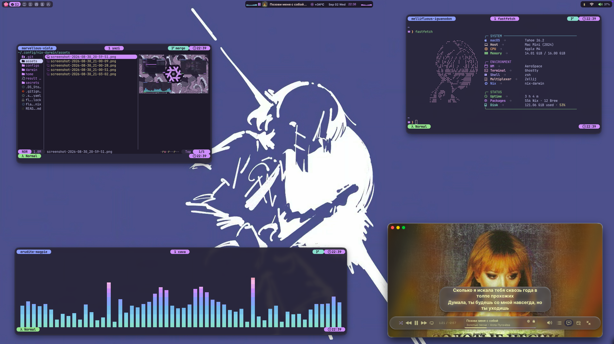
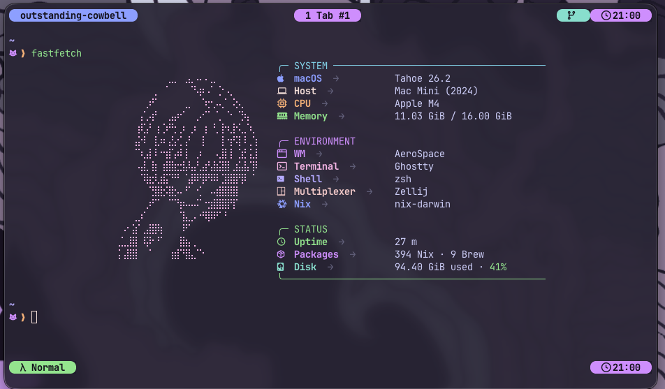
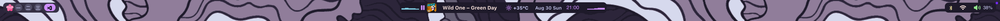
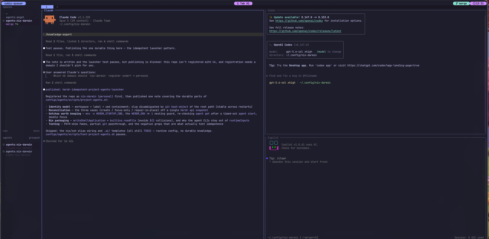

<div align="center">
  

  <h1>nix-darwin · Catppuccin Mocha</h1>

  <p>
    A declarative macOS configuration built with nix-darwin, Home Manager,<br />
    AeroSpace, SketchyBar, Ghostty, and a cohesive terminal environment.
  </p>

  <p>
    
    
    
    
  </p>
</div>



> [!IMPORTANT]
> This repository is a personal configuration, not a universal installer. Before the first `switch`, you must change the username, hostname, age key, secrets, Zen profile, and monitor layout. Read [Required preparation](#required-preparation) first.

## What is included

| Area | Components |
| --- | --- |
| System | nix-darwin, Nixpkgs unstable, flakes, and declarative macOS preferences |
| User environment | Home Manager and Catppuccin Mocha with a mauve accent |
| Desktop | AeroSpace, JankyBorders, SketchyBar, and wallpaper rotation |
| Terminal | Ghostty, Zsh, Starship, Zellij, Fastfetch, and Yazi |
| CLI | Neovim, Git, GitHub CLI, ripgrep, fd, fzf, zoxide, bat, eza, jq, yq, and more |
| Media | CAVA, Now Playing, artwork, media controls, and optional Cider support |
| Applications | Zen, Arc, VS Code, DataGrip, Raycast, Ghostty, ONLYOFFICE, and SF Symbols through Homebrew |
| Agents | Claude Code, Codex, and Copilot with a Herdr workspace launcher and shared skills |
| Secrets | SOPS + age for the Git name and email address |

The configuration is split into two main layers:

- `darwin/` manages the system, Homebrew, fonts, AeroSpace, borders, and macOS preferences.
- `home/` manages the user account, CLI programs, and configuration files.
- `configs/` contains independent modules for each application.
- `configs/sketchybar/` contains the Lua implementation of the bar.
- `configs/agents/` contains the coding-agent tooling: MCP servers, shared skills, and the `project-agents` and `agent-project-init` commands.
- `assets/` contains the screenshots used in this document.
- `secrets/` contains SOPS-encrypted secrets; it must never contain private age keys.

## Screenshots

### Terminal and Fastfetch



### SketchyBar




## Requirements

- An Apple Silicon Mac. The repository explicitly uses `aarch64-darwin`.
- macOS Tahoe is the tested system. Older versions may require adjustments.
- An account with administrator privileges.
- Internet access for Nix, Homebrew, flakes, weather data, artwork, and external themes.
- Xcode Command Line Tools.
- Nix installed in multi-user mode.
- Your own age key if you keep the SOPS integration.
- Recommended: at least one primary monitor. The current configuration also references a `secondary` monitor.

The official Nix documentation recommends a multi-user installation on macOS. Refer to the [Nix installation guide](https://nix.dev/manual/nix/latest/installation/) and the [nix-darwin README](https://github.com/nix-darwin/nix-darwin/blob/master/README.md) if your system already has Nix or uses an alternative Nix distribution.

## Installation

### 1. Install Apple developer tools

```bash
xcode-select --install
```

Wait for the installation to finish before continuing.

### 2. Install Nix

The official multi-user installation command is:

```bash
curl -L https://nixos.org/nix/install | sh -s -- --daemon
```

Close and reopen your terminal after installing Nix. Verify the installation:

```bash
nix --version
```

> [!WARNING]
> Do not mix Nix installers without reviewing their documentation first. Manually uninstalling Nix on macOS can be difficult.

### 3. Clone your fork

Create a fork to keep your customizations, then clone it after replacing `YOUR_USERNAME`:

```bash
git clone https://github.com/YOUR_USERNAME/nix-darwin.git ~/.config/nix-darwin
cd ~/.config/nix-darwin
```

If `~/.config/nix-darwin` already exists, back it up or choose another location. Do not overwrite it blindly.

## Required preparation

Do not run the first `switch` until you have reviewed every item below.

### Username and hostname

Edit `flake.nix`:

```nix
let
  username = "your_username";
  hostname = "your-mac-name";
in
```

You can retrieve the current values with:

```bash
id -un
scutil --get LocalHostName
```

The hostname also determines the name of the flake output used in `.#hostname`.

### Architecture

`darwin/default.nix` contains:

```nix
nixpkgs.hostPlatform = "aarch64-darwin";
```

Keep this value for Apple Silicon. On an Intel Mac, use `x86_64-darwin`, disable `nix-homebrew.enableRosetta`, and review any ARM-only dependencies. Intel is not tested by this configuration.

### Monitors and workspaces

`configs/aerospace.nix` assigns workspaces `1`–`5` to the primary monitor and `8`–`9` to the secondary monitor. If you only use one monitor, remove or adapt these entries:

```nix
workspace-to-monitor-force-assignment = {
  "1" = "main";
  # ...
  "8" = "secondary";
};
```

### Zen Browser profile

Open Zen at least once, visit `about:profiles`, and copy your profile name. Replace the value in `configs/zen.nix`:

```nix
profile = "Library/Application Support/zen/Profiles/YOUR_PROFILE";
```

If you do not use Zen, remove `../configs/zen.nix` from `home/default.nix` and optionally remove the `zen` cask from `darwin/homebrew.nix`.

### Time zone

Replace both occurrences of `America/Monterrey` in `configs/zellij.nix` with a valid IANA time zone such as `Europe/Madrid` or `America/Bogota`.

### Applications and preferences

Review these files before applying the configuration:

- `darwin/homebrew.nix`: applications that will be installed and upgraded.
- `configs/macos.nix`: Dock, Finder, trackpad, menu bar, and WindowManager settings.
- `configs/wp/`: wallpapers that rotate every 15 minutes.
- `home/packages.nix`: CLI packages installed for your user.

`nix-homebrew.autoMigrate = true` allows nix-homebrew to adopt an existing Homebrew installation, while `enableRosetta = true` enables x86_64 support on Apple Silicon. Review both options if your machine already has a customized Homebrew installation.

## Configure SOPS and age

The original owner's private key is not included in this repository. The included `secrets/personal.yaml` is encrypted for a different recipient, so you will not be able to decrypt it.

Open a temporary shell with the required tools:

```bash
nix --extra-experimental-features "nix-command flakes" shell nixpkgs#age nixpkgs#sops
```

Generate your key in the location expected by this configuration:

```bash
key_dir="$HOME/Library/Application Support/sops/age"
mkdir -p "$key_dir"
age-keygen -o "$key_dir/keys.txt"
chmod 600 "$key_dir/keys.txt"
age-keygen -y "$key_dir/keys.txt"
```

The last command prints a public recipient beginning with `age1`. Replace the existing recipient in `.sops.yaml` with your own.

Then replace the repository secret:

```bash
mv secrets/personal.yaml secrets/personal.yaml.upstream
${EDITOR:-nano} secrets/personal.yaml
```

Enter your data using this structure:

```yaml
git:
  name: "Your name"
  email: "your-email@example.com"
```

Immediately encrypt the file and remove the upstream copy:

```bash
sops --encrypt --in-place secrets/personal.yaml
rm secrets/personal.yaml.upstream
```

Verify that the values now appear as `ENC[...]` before adding them to Git:

```bash
sops --decrypt secrets/personal.yaml
git diff -- secrets/personal.yaml .sops.yaml
```

> [!CAUTION]
> Never publish `~/Library/Application Support/sops/age/keys.txt`. The private key can decrypt every secret intended for its recipient. Keep a secure backup outside the repository.

If you do not want to use SOPS, remove `../configs/sops.nix` from `home/default.nix` and replace the SOPS-dependent `include.path` in `configs/git.nix` with conventional Git user settings.

## First activation

Replace `YOUR_HOSTNAME` with the value configured in `flake.nix`:

```bash
sudo nix --extra-experimental-features "nix-command flakes" \
  run nix-darwin/master#darwin-rebuild -- \
  switch --flake .#YOUR_HOSTNAME
```

Subsequent activations can use:

```bash
sudo darwin-rebuild switch --flake .#YOUR_HOSTNAME
```

To evaluate and build without activating any changes:

```bash
darwin-rebuild build --flake .#YOUR_HOSTNAME
```

The first activation may take a while because it installs Nix packages, Homebrew, applications, fonts, and launchd services.

## macOS permissions

Some capabilities cannot be authorized declaratively. You must grant them through System Settings.

### App Management

macOS may ask your terminal for permission to update `/Applications/Nix Apps`. Grant it under:

`System Settings → Privacy & Security → App Management`

Run the `switch` from a graphical session. Running it exclusively over SSH may prevent the permission dialog from appearing.

### AeroSpace

Grant AeroSpace accessibility access under:

`System Settings → Privacy & Security → Accessibility`

Without this permission, AeroSpace cannot focus, move, or resize windows.

### SketchyBar and system audio

The spectrum uses CAVA with CoreAudio `source = tap`. Home Manager installs a stable host at:

```text
~/Applications/SketchyBar.app
```

Its bundle identifier is `dev.angelyahir.sketchybar`. Add the application under:

`System Settings → Privacy & Security → Screen & System Audio Recording → System Audio Recording Only`

If the picker opens `/Applications` instead of your home Applications directory, press `Cmd+Shift+G` and enter:

```text
/Users/YOUR_USERNAME/Applications/SketchyBar.app
```

When you run CAVA manually from a terminal, macOS associates the permission with that terminal. This is separate from the permission granted to `SketchyBar.app`.

## Daily use

### AeroSpace shortcuts

| Shortcut | Action |
| --- | --- |
| `Alt + H/J/K/L` | Change focus |
| `Alt + Shift + H/J/K/L` | Move the window |
| `Alt + 1…5`, `Alt + 8/9` | Change workspace |
| `Alt + Shift + number` | Send the window to a workspace |
| `Alt + ←/→` | Change monitor |
| `Alt + Shift + ←/→` | Send the window to another monitor |
| `Alt + Enter` | Open a Ghostty window |
| `Alt + F` | Toggle floating and tiling |
| `Alt + R` | Enter resize mode |
| `Ctrl + Cmd + drag` | Move a window from any point |

In resize mode, use `H/J/K/L`. Add `Shift` for smaller increments. Press `Enter` or `Esc` to return to the main mode.

### SketchyBar

The bar displays:

- Workspaces and open applications.
- A CAVA spectrum, playback state, artwork, and a static title.
- Media controls in a popup opened by clicking the media widget.
- Weather from `wttr.in`, the date, and the time.
- Wi-Fi, Bluetooth, volume, and battery status.

The media widget first uses Cider's local API when it finds a token named `SketchyBar`; otherwise, it uses Now Playing sessions published by macOS. Cider is optional and is not installed by this configuration.

### Coding agents



`configs/agents/` installs Claude Code, Codex, and Copilot, points all three at the
Context7 MCP server, and shares one set of skills between `~/.claude/skills/` and
`~/.agents/skills/`.

Two commands drive the workflow:

| Command | Alias | Action |
| --- | --- | --- |
| `project-agents` | `agents` | Opens or re-attaches a three-pane [Herdr](https://github.com/herdrdev/herdr) workspace running Claude, Codex, and Copilot against the current project |
| `agent-project-init` | `aiinit` | Copies the agent scaffolding (`.ai/`, `CLAUDE.md`, `AGENTS.md`, and the orchestration skills) into the current repository |

`agents` is idempotent: it identifies the workspace by label and working directory,
so running it again focuses the existing panes instead of creating duplicates, and
restarts only the agents that are no longer alive. Run it from anywhere inside the
repository; the panes open in the directory you launched it from.

The scaffolding written by `aiinit` is agent memory, not documentation, and it is
listed in `.gitignore`. Edit `.ai/PROJECT.md` first so the agents have project
context.

### Wallpapers

The `wallpaper-rotation` agent cycles through images in `configs/wp/` every 900 seconds. You can replace them with JPG, PNG, HEIC, or WebP files. Keep at least one image in the directory or the agent will exit with an error.

## Updating

Update the inputs and review the `flake.lock` diff:

```bash
nix flake update
git diff -- flake.lock
```

Build before activating:

```bash
darwin-rebuild build --flake .#YOUR_HOSTNAME
sudo darwin-rebuild switch --flake .#YOUR_HOSTNAME
```

> [!WARNING]
> `darwin/homebrew.nix` sets `autoUpdate = true` and `upgrade = true`. Every activation may update Homebrew and GUI applications even when the cask list has not changed. `cleanup = "none"` prevents applications outside this configuration from being automatically uninstalled.

Do not change `system.stateVersion` or `home.stateVersion` after installation merely to “update” them. These values control state compatibility, not package versions.

## Troubleshooting

### `darwin-rebuild: command not found`

Use the bootstrap command again:

```bash
sudo nix --extra-experimental-features "nix-command flakes" \
  run nix-darwin/master#darwin-rebuild -- \
  switch --flake .#YOUR_HOSTNAME
```

Then open a new terminal and confirm that `/run/current-system/sw/bin` is in `PATH`.

### SOPS cannot retrieve the data key

Check the key file and its public recipient:

```bash
ls -l "$HOME/Library/Application Support/sops/age/keys.txt"
age-keygen -y "$HOME/Library/Application Support/sops/age/keys.txt"
```

The resulting recipient must match `.sops.yaml` and one of the recipients in `secrets/personal.yaml`.

### Zen does not load the theme

- Confirm the profile name in `about:profiles`.
- Close Zen during activation.
- Verify that `toolkit.legacyUserProfileCustomizations.stylesheets` is set to `true` in `about:config`.

### AeroSpace does not control windows

- Check the Accessibility permission.
- Confirm that the `secondary` assignment refers to an existing monitor.
- Inspect the evaluated bindings with `aerospace config --get mode.main.binding`.

### SketchyBar repeatedly requests audio access

Verify the host signature:

```bash
codesign -dvvv ~/Applications/SketchyBar.app 2>&1 | grep Identifier
codesign --verify --deep --strict --verbose=2 ~/Applications/SketchyBar.app
```

The expected identifier is `dev.angelyahir.sketchybar`. Also inspect:

```bash
tail -n 100 /tmp/sketchybar-host.error.log
tail -n 100 /tmp/sketchybar-media-spectrum.log
```

After granting audio permission, restart your session or run the `switch` again.

### Music or artwork does not appear

- Confirm that the application publishes a macOS Now Playing session.
- For Cider, enable its local API and create a token with the exact name `SketchyBar`.
- Weather and artwork require network access; firewalls or filtered DNS may prevent updates.

## Palette

The interface follows Catppuccin Mocha. Its primary colors are:

| Token | Hex | Primary use |
| --- | --- | --- |
| Base | `#1e1e2e` | Backgrounds |
| Mantle | `#181825` | Dark panels |
| Text | `#cdd6f4` | Primary text |
| Mauve | `#cba6f7` | Main accent |
| Blue | `#89b4fa` | States and sessions |
| Sky | `#89dceb` | Spectrum and information |
| Green | `#a6e3a1` | Successful states |
| Red | `#f38ba8` | Warnings |

Keeping this palette when extending the configuration helps Ghostty, Zellij, Fastfetch, SketchyBar, and JankyBorders feel like a single environment.

